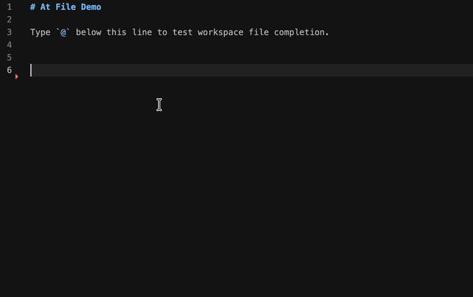

# At File

At File is a VS Code extension that completes workspace files and directories when you type `@`.

## Usage

Open a supported file and type `@`. VS Code will show matching files and directories from the current workspace. Selecting an item inserts a relative path:



```text
@src/components/Button.tsx
@src/components/
```

## Configuration

```json
{
  "atFile.enabledExtensions": ["md", "txt"],
  "atFile.exclude": ["node_modules", "target", ".git", "dist", "build"],
  "atFile.maxResults": 20
}
```

`atFile.enabledExtensions` values should not include the leading dot.

`atFile.exclude` accepts directory names such as `node_modules` and glob patterns such as `**/generated/**`.

## Commands

- `At File: Refresh Index`: clears the cached workspace index.

## Development

```bash
npm install
npm test
```

Press `F5` in VS Code to launch an Extension Development Host.

The extension entry is `out/src/extension.js`, generated from `src/extension.ts`.

The debug host opens `sample-workspace/at-file-demo.md`, so typing `@` in that file should immediately show file completions.
